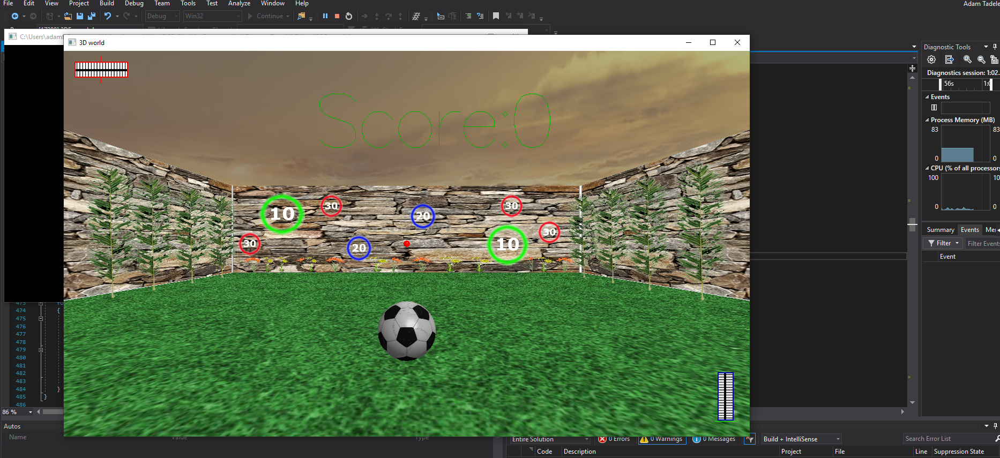

# 3D-world
This is a perspective viewed 3D world with a static scene. The sky moves which gives the scene a realistic feel and view.

The 3D world has taught me:

* The funamentals of 3D rendering
* Mathematics to create 3D worlds such as Polar Coordinates in 3D, matrics, vertices e.c.t
* Texturing
* Lighting in 3D enviroments
* GLUT library
* Real-time graphics
* Perspective view
* Orthographic projection
* OpenGL 
